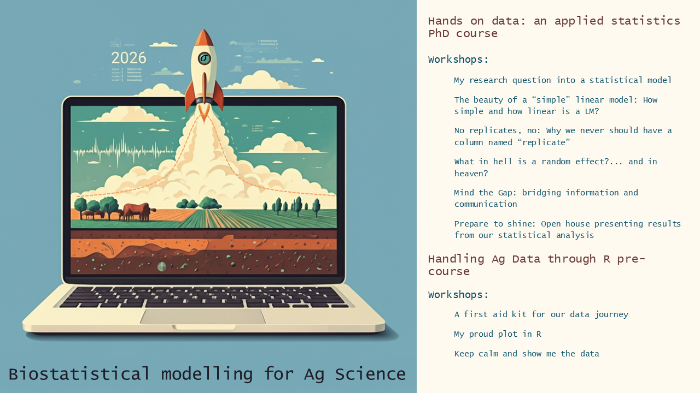

# Biostatistical Modelling for Agricultural Science (2026)

This repository contains the materials and curriculum for the **Biostatistical Modelling for Agricultural Science** PhD course. The program focuses on providing PhD students with the tools for rigorous data management and methodological discussion within the context of Agroecological research.

## 📋 Course Overview

* **ECTS:** 5.0 (Full course) / 3.5 (Main course only).
* **Language:** English.
* **Capacity:** 20 participants (First-come, first-served).
* **Total workload:** 125 hours (including preparation and assignments).

## 🗓️ Important Dates & Location

* **Course dates:** February 3–13, 2026 (09:00 - 17:00).
* **Assessment date:** February 27, 2026 (Mandatory; in-person or online).
* **Location:** Aarhus University Viborg, Blichers Alle 20, 8830 Tjele, Denmark.

---

## 🎯 Learning Outcomes
By the end of this course, students will be able to:
* Choose and apply exploratory data tools to discover patterns in data.
* Recognise experimental designs and appropriately handle them statistically.
* Employ common statistical methods (e.g., General Linear Mixed Models, GLMM) for data analysis and understand their strengths and weaknesses.
* Describe, interpret and discuss the results and shortcomings of an analysis based on statistical modelling.
* Build attractive and informative graphics and tables from applied statistical analysis.
* Report the results of an applied statistical analysis according to ethics of science.

---

---

## 📖 Course Content

### Module 1: Handling Ag Data through R (Pre-workshop)
*Necessary to complete 5 ECTS (1.5 ECTS, 48 hours)*.

1.  **Getting started:** Introduction to R and RStudio, syntax, and work projects.
2.  **Data frames:** Reading/importing data (Excel, etc.), sorting, and creating subsets.
3.  **Graphics:** Base R `plot()` and advanced plotting with `ggplot2`.
4.  **Functions:** Defining custom functions, loops, and the `apply` family.
5.  **Descriptive statistics:** Variability, central tendency, skew, kurtosis, and data management.

### Module 2: Hands-on Data - Applied Statistics (Main Course)
*(3.5 ECTS, 90 hours)*.

1.  **Exploratory analysis:** Qualitative and quantitative data types.
2.  **Statistical modelling:** Notation, uncertainty, and covariate modeling.
3.  **Experimental design:** Randomization, replication, factorial structures, crossed/nested factors, and split-plot designs.
4.  **Mixed Models (GLMM):** Simple/multiple linear regression, random effects, BLUPs, and longitudinal data.
5.  **Communication:** Reproducible research (Git/GitHub), Open Data, and good presentation practices.

---

## 👩‍🏫 Teaching Team
* **Maarit Mäenpää:** Statistician, Dept. of Agroecology.
* **Simon Riley:** Statistician, Dept. of Agroecology.
* **Franca Giannini-Kurina:** Postdoc, Soil Fertility Section.

## 🎓 Assessment
Individual student evaluation (**Pass/Not Pass**) is based on the analysis of their own research data. This culminates in a **poster session** and an open-door session where students present their findings and demonstrate their ability to interpret results within their specific research context.

## 📅 Detailed Course Schedule

The course is structured into a 3-day R Pre-workshop followed by a week-long intensive Biostatistics module. All sessions run from **09:00 to 17:00**.

### Part 1: Pre-Workshop (R Foundations)
| Date | Theme | Key Topics |
| :--- | :--- | :--- |
| **Feb 3 (Tue)** | **A first aid kit for our data journey** | R syntax, work environments, reading data, and base plots. |
| **Feb 4 (Wed)** | **My proud plot in R** | Grammar of Graphics, `ggplot2` practice, and descriptive statistics. |
| **Feb 5 (Thu)** | **Keep calm and show me the data** | Data models, Tidyverse foundations, and preparing your own journey. |
| **Feb 6 (Fri)** | **Free reading/commuting day** ||

### Part 2: Main Course (Applied Statistics)
| Date | Theme | Key Topics |
| :--- | :--- | :--- |
| **Feb 9 (Mon)** | **My research question into a model** | Presentation rounds, sorting games, and statistical geometry. |
| **Feb 10 (Tue)** | **The beauty of a "simple" linear model** | Linear model theory, residuals, and multiple linear regression. |
| **Feb 11 (Wed)** | **No replicates, no model** | Random effects, model assumptions, and experimental design principles. |
| **Feb 12 (Thu)** | **What in hell is a random effect?** | Mixed models for experimental vs. observational data; model evaluation. |
| **Feb 13 (Fri)** | **Mind the Gap: bridging info & comms** | Communicating results, GLM glimpses, and poster draft preparation. |

---

### Assessment Day
| Date | Theme | Activity |
| :--- | :--- | :--- |
| **Feb 27 (Fri)** | **Prepare to Shine** | **Final Assessment:** Mandatory presentation of your data analysis (in-person or online). |

---

## Daily Routine
* **09:00 – 10:30:** Morning session A (Lectures & Coding).
* **10:30 – 10:45:** Coffee Break.
* **10:45 – 12:00:** Morning session B (Practical Work).
* **12:00 – 13:00:** Lunch Break.
* **13:00 – 14:30:** Afternoon session A (Group Activities/Lectures).
* **14:30 – 15:00:** Coffee Break.
* **15:00 – 17:00:** Afternoon session B & Co-working (Data Wrangling & Support).

## 📜 License
This repository is licensed under the **MIT License** for code and **CC BY 4.0** for educational content.
